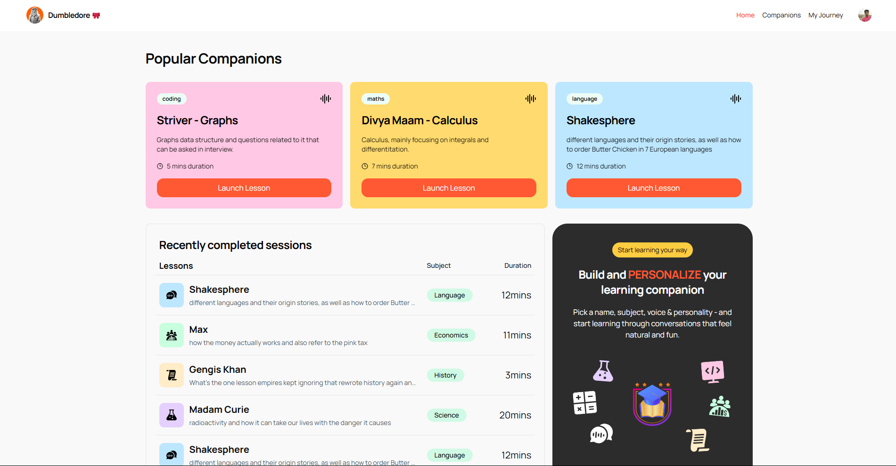
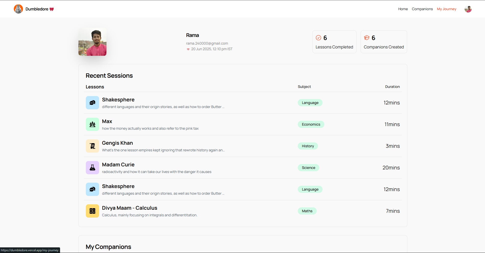
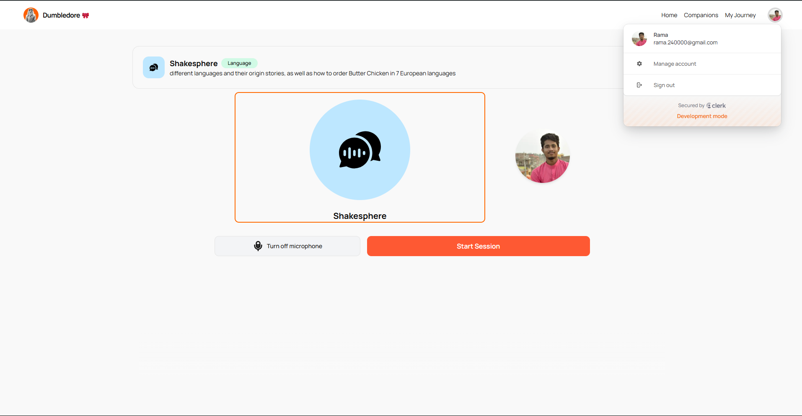
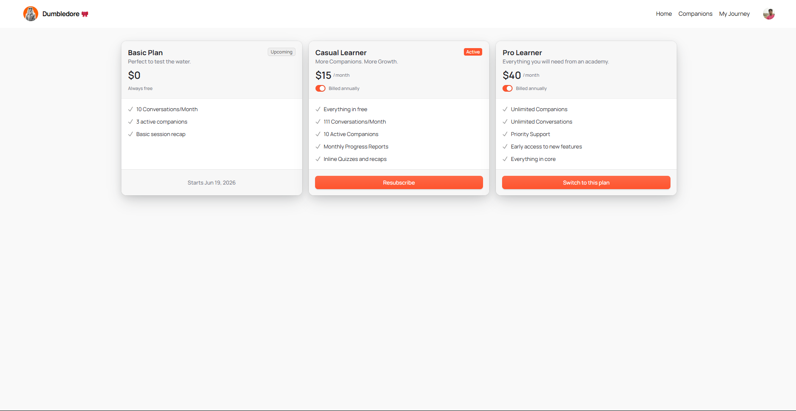

# 🧙‍♂️ Dumbledore — AI-Powered Interactive Voice Tutor



**Dumbledore** is a next-gen AI tutor platform that talks with you — understands your voice, adapts tone & context, and teaches interactively with human-like conversation, just like having a wise mentor by your side.

🚀 **[Live Demo](https://dumbledore.vercel.app/)**

---

## 📸 Screenshots

<div align="center">
  
  
</div>

<div align="center">
  
  
<p> <i>... and many more </i></p>
</div>

---

## ✨ Key Features

| Feature                            | Description                                                             |
| ---------------------------------- | ----------------------------------------------------------------------- |
| 🎤 **Voice Interaction**           | Two-way voice conversations with interruption detection                 |
| 🧑‍🤝‍🧑 **Voice Profiles**        | Male/Female voices, formal & casual tones powered by ElevenLabs         |
| 🧠 **Contextual AI**               | GPT-4 powered understanding that responds based on conversation context |
| 🔒 **Auth & Billing**              | Seamless user management & subscription via Clerk + Stripe              |
| ⏳ **Active Status Tracking**       | Real-time user activity tracked with Clerk's `lastActiveAt`             |
| 🧪 **Feature Gating**              | Usage limits and feature access control per user plan                   |
| 📊 **My Journey Dashboard**        | View your AI companions and historical learning sessions                |
| ⚡ **Smart Routing**                | Adaptive UI navigation based on user status & context                   |
| 🛠 **Monitoring & Error Tracking** | Sentry integration for crash and error reporting                        |
| 🗄 **Backend & Database**          | Supabase for secure, scalable data storage                              |

---

## 🧩 Tech Stack

| Layer          | Technology                     |
| -------------- | ------------------------------ |
| Frontend       | Next.js                        |
| AI & Voice     | OpenAI GPT-4, Vapi, ElevenLabs |
| Authentication | Clerk                          |
| Billing        | Clerk + Stripe                 |
| Database       | Supabase                       |
| Monitoring     | Sentry                         |
| Deployment     | Vercel                         |

---

## 🚀 Getting Started

### 1. Clone the repository

```bash
git clone https://github.com/your-username/dumbledore.git
cd dumbledore
```

### 2. Install dependencies

```bash
npm install
```

### 3. Setup Environment Variables

Create `.env.local` with your keys:

```env
NEXT_PUBLIC_CLERK_PUBLISHABLE_KEY=your_clerk_key
CLERK_SECRET_KEY=your_clerk_secret
SUPABASE_URL=your_supabase_url
SUPABASE_KEY=your_supabase_key
VAPI_API_KEY=your_vapi_key
SENTRY_DSN=your_sentry_dsn
```

### 4. Run locally

```bash
npm run dev
```

Open [http://localhost:3000](http://localhost:3000) to view it in your browser.

---

## 🛠 Usage & Development

* **Voice Interaction**: Powered by GPT-4 and ElevenLabs voices for natural conversations
* **Authentication**: Secure user management handled by Clerk (login, subscription, active status)
* **Feature Gating**: Usage limits and access control based on subscription plans
* **Session Tracking**: Historical data stored in Supabase with "My Journey" dashboard
* **Real-time Monitoring**: Sentry integration for stability and error tracking
* **Responsive Design**: Optimized for desktop and mobile experiences


---

## 🎯 Features in Action

- **🏠 Home Dashboard**: Quick access to your AI tutor and recent sessions
- **👤 Profile Management**: Customize your learning preferences and view activity
- **📞 Voice Calls**: Seamless voice interaction with AI-powered responses
- **💳 Billing & Plans**: Flexible subscription management with Stripe integration

---

## 🤝 Contributing

We welcome contributions! Feel free to:

* Open issues or feature requests
* Submit pull requests
* Suggest improvements or feedback
* Report bugs or performance issues


---

## 💡 Contact & Support

Reach out anytime for help, collaboration, or feedback!

**Live App**: [https://dumbledore.vercel.app/](https://dumbledore.vercel.app/)

---

*Made with ❤️ by Rama*
